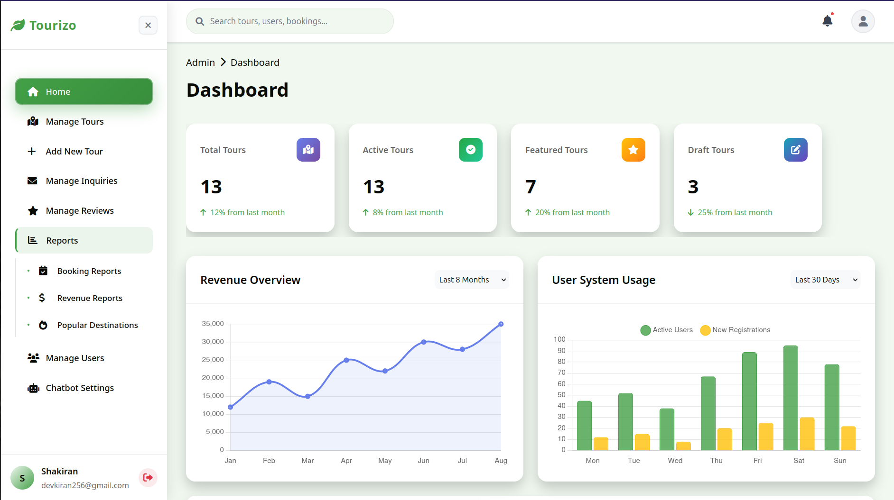
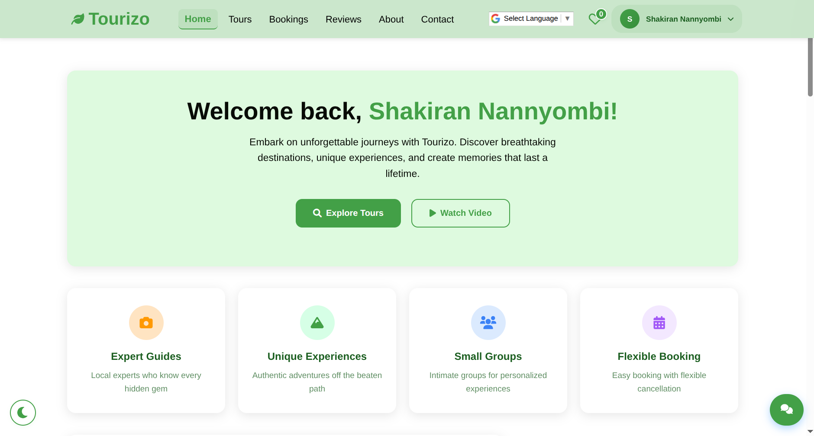

# Tourizo: Tour and Travels Web App

**Live Demo: [https://tourizo.onrender.com](https://tourizo.onrender.com)**

## Project Overview

Tourizo is a full-featured web application for managing tour packages, bookings, reviews, and admin analytics. Built with Flask, it features a modular architecture using Blueprints, SQLAlchemy models, and a modern, responsive UI. The platform supports both travelers and administrators, with robust authentication, payment simulation, chatbot integration, and analytics.

---

## Screenshots

### Welcome Page


### Admin Dashboard



### User Dashboard



---

## Features

- **User Authentication & Profiles**: Registration, login/logout, profile management, password reset, and user settings.
- **Tour Management**: CRUD for tours, categories, destinations, search/filter, wishlist, and detailed tour pages.
- **Booking System**: Book tours, select payment methods (Mobile Money, Card, Bank Transfer), booking history, and secure payment simulation.
- **Reviews**: Users can review tours they’ve booked, with a guided review flow and admin moderation.
- **Admin Dashboard**: Manage users, tours, bookings, reviews, and inquiries. View analytics and reports (bookings, revenue, destinations).
- **Chatbot Integration**: Admins can configure and test a Groq-powered AI chatbot for user support and FAQs.
- **Contact & Inquiries**: Contact form, inquiry management, and email notifications.
- **Policies & Legal**: Booking, cancellation, privacy, and terms pages.
- **Responsive UI**: Mobile-friendly, modern design with custom CSS and Bootstrap.
- **Error Handling**: Custom 401, 403, 404, and 500 error pages.

---

## Project Structure

```
Tourizo/
│
├── app/
│   ├── __init__.py
│   ├── admin.py
│   ├── auth.py
│   ├── bookings.py
│   ├── config.py
│   ├── decorators.py
│   ├── email_service.py
│   ├── email_utils.py
│   ├── extensions.py
│   ├── filters.py
│   ├── forms.py
│   ├── models/
│   ├── pesapal_utils.py
│   ├── policies.py
│   ├── reviews.py
│   ├── static/
│   ├── templates/
│   ├── tours.py
│   └── utils.py
│
├── migrations/
├── requirements.txt
├── run.py
└── README.md
```

---

## Setup Instructions

1. **Clone the repository:**

   ```bash
   git clone <repo-url>
   cd Tourizo
   ```

2. **Create a virtual environment:**

   ```bash
   python3 -m venv venv
   source venv/bin/activate
   ```

3. **Install dependencies:**

   ```bash
   pip install -r requirements.txt
   ```

4. **Run the app:**

   ```bash
   python run.py
   ```

   The app will be available at [http://127.0.0.1:5000/](http://127.0.0.1:5000/).

---

## Key Blueprints

- `auth_bp`: Authentication and user management
- `tours_bp`: Tour listing, details, and search
- `bookings_bp`: Booking flow and payment
- `admin_bp`: Admin dashboard and analytics
- `reviews_bp`: Reviews and ratings
- `contact_bp`: Contact and inquiries
- `policies_bp`: Policy and legal pages
- `chatbot_bp`: API for AI chatbot

---

## API Endpoints

- `/api/chat`: POST endpoint for chatbot queries (admin-configurable, Groq-powered)
- `/admin/*`: Admin dashboard and management
- `/tours/*`: Tour browsing and details
- `/bookings/*`: Booking and payment
- `/reviews/*`: Review flow

---

## Notable User Flows

- **Book a Tour**: Browse tours → Book → Choose payment → Confirmation
- **Write a Review**: Go to “Write a Review” → Select tour → Submit review
- **Admin Management**: Dashboard → Manage users/tours/bookings/reviews → View analytics
- **Chatbot**: Admin configures/test chatbot in dashboard; users interact via live chat

---

## Configuration & Customization

- All models use SQLAlchemy (see `app/models/`).
- Blueprints are registered in `app/__init__.py`.
- Use `base.html` for template inheritance.
- Update `config.py` for production settings (secret key, database URI, email, etc).
- For email, configure Flask-Mail in `config.py` and `email_service.py`.
- Chatbot settings are managed in the admin dashboard.

---

## Contributors

- **User Authentication & Profiles**: `auth.py`, `models/User.py`, templates/auth/
- **Tour Management**: `tours.py`, `models/Tour.py`, templates/tours/
- **Booking & Payments**: `bookings.py`, `models/Booking.py`, templates/bookings/
- **Admin Dashboard**: `admin.py`, templates/admin/
- **Reviews & UI/UX**: `reviews.py`, templates/reviews/
- **Chatbot & API**: `api/chatbot.py`, templates/admin/chatbot_settings.html

---

## License

MIT License

---

Happy coding! 🚀
